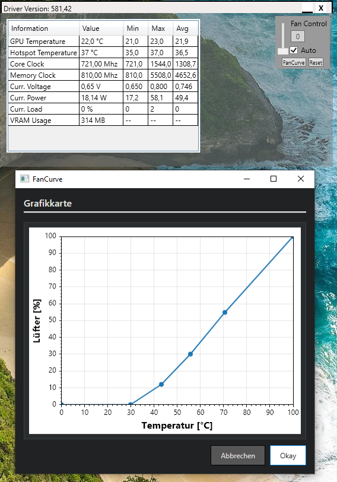

# Volt – GPU Monitoring and Control Tool (C# / WPF)

Volt ist ein selbst entwickeltes Desktop-Tool zur Anzeige und Analyse von Grafikkarteninformationen sowie zur Visualisierung und Konfiguration von GPU-Parametern.

Das Projekt wurde zur Vertiefung meiner Kenntnisse in C#, WPF und systemnaher Hardwarekommunikation entwickelt.

## Funktionen

- Auslesen und Anzeigen von GPU-Informationen
- Anzeige von Temperatur, Taktraten und Lüfterdaten
- Visualisierung der Lüfterkurve
- Verarbeitung und Darstellung von Hardwaredaten
- Moderne Desktopoberfläche mit WPF

## Technologien

- C#
- WPF (.NET Desktop)
- Hardware Monitoring
- Binary und Hardware-nahe Datenverarbeitung

## Projektstruktur

- MainWindow.xaml – Hauptoberfläche
- FanCurve.xaml – Visualisierung der Lüfterkurve
- AMD_GPU.cs – GPU-Datenstrukturen
- LibreHM.cs – Hardware Monitoring Integration
- nvOC.cs – GPU-bezogene Funktionen

## Motivation

Dieses Projekt dient der praktischen Vertiefung meiner Kenntnisse in:

- C# Desktopentwicklung
- WPF UI Entwicklung
- Hardwarekommunikation
- Verarbeitung technischer Daten
##

## Autor

BangerDachs
